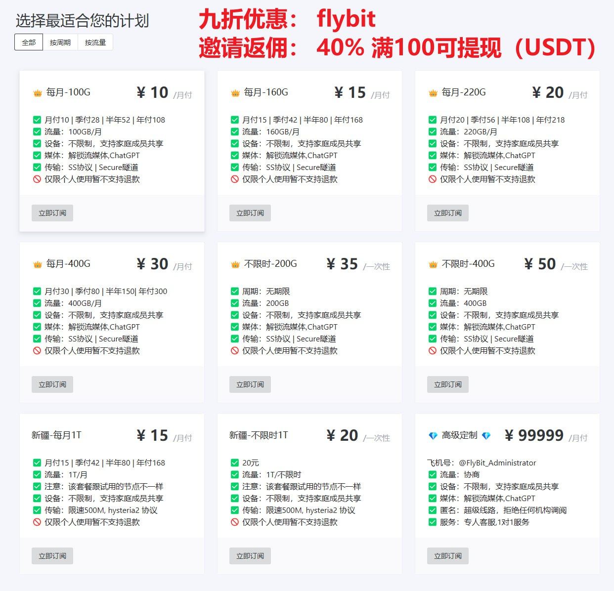
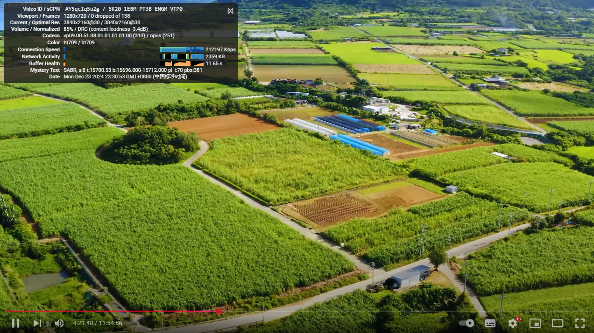

# FlyBit机场2025年最新可用域名（机场导航|机场推荐|梯子推荐|VPN|加速器|Netflix解锁|科学上网|翻墙代理|VPN导航|科学上网）

---

## 可用优惠券（九折）
### flybit

---

## 网址
### 地址导航: https://goflybit.pages.dev
### 永久地址: https://flybit.vip (被墙，需挂梯子)
### Telegram公告频道: [https://t.me/flybitvip_channel](https://t.me/flybitvip_channel)
### Telegram讨论群组: [https://t.me/flybitvip](https://t.me/flybitvip)
### 可用地址1：https://flybit.best
### 可用地址2：https://flybit.my

---

## 套餐信息

---

## 节点信息

---

## 测速图

---

## 油管4K

---

## 节点
* 香港
* 美国
* 日本
* 韩国
* 新加坡
* 印度
* 德国
* 英国
* 巴西
* 澳大利亚
* 阿联酋
* 俄罗斯
* 马来西亚
* 泰国
* 越南
* 法国
* 哈萨克斯坦
* 土耳其
* 瑞典
* 埃及
* 南非
* 乌克兰
* 印度尼西亚
* 立陶宛
* 孟加拉
* 荷兰
* 瑞士
* 新西兰
* 保加利亚
* 加拿大
* 匈牙利
* 多哥
* 意大利
* 挪威
* 捷克
* 柬埔寨
* 阿塞拜疆
* 墨西哥
* 以色列
* 墨西哥
* 冰岛
* 葡萄牙
* 丹麦

---

## 特点：

* IEPL+中转，全部倍率都是1，油管可以跑到50w+
* 全网最便宜IEPL套餐
* 不限制设备数
* 提供1天2G免费试用，满意才付款。极致性价比
* 解锁流媒体：Netflix、BBC iPlayer、Hulu、Amazon Prime Video、Disney+、HBO以及YouTube Premium、Spotify
* 解锁ChatGPT、Gemini 等AI
* 支持的设备：Windows电脑、Mac电脑、iOS、安卓、Linux、路由器、安卓电视
* 查资料、学英语、上网课、留学必备
* 新加坡华人创建
